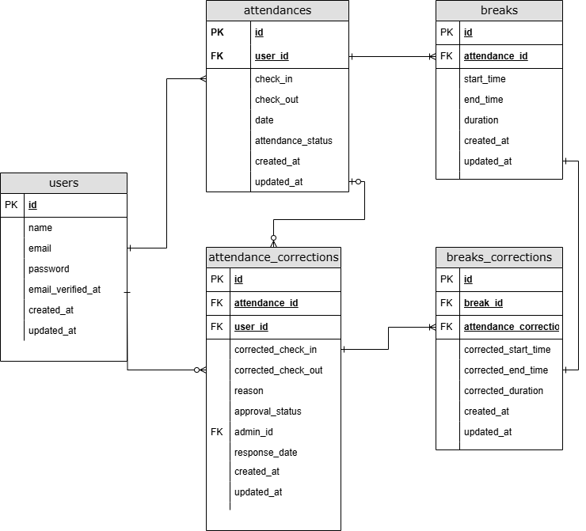

# kintai

## プロジェクト概要
### Webサービス制作の概要・方針決定
- サービス名：coachtech 勤怠管理アプリ
- サービス概要：ある企業が開発した独自のフリマアプリ
- 制作の背景と目的：ユーザーの勤怠と管理を目的とする
- 制作の目標：初年度でのユーザー数1000人達成
- 作業範囲	：設計、コーディング、テスト
- 納品方法：GitHubでのリポジトリ共有
  
### 業務要件一覧
- 現行のサービスの分析：新規サービスのため、考慮しない
- 競合他社の調査・分析：機能や画面が複雑で使いづらい
  
### サイト要件一覧
- ターゲットユーザー：10~30代の社会人
- ターゲットブラウザ・OS：PC：Chrome/Firefox/Safari 最新バージョン
- ページ一覧：https://docs.google.com/spreadsheets/d/1u89sHiEaRxqMKWmm6MGfyheeUod1XAdbim3ncObOWYU/edit?pli=1&gid=1998718085#gid=1998718085&range=B2
  
### システム要件一覧
- 機能要件一覧：https://docs.google.com/spreadsheets/d/1u89sHiEaRxqMKWmm6MGfyheeUod1XAdbim3ncObOWYU/edit?pli=1&gid=366694298#gid=366694298
- 非機能要件一覧：運用・保守について	クライアントが運用・保守を行う
- リリースについて：4ヶ月後を予定
- セキュリティについて：アプリケーション内に限り考慮する
- SEOについて：考慮しない
- コード品質について：コーディング規約（https://estra-inc.notion.site/1263a94a2aab4e3ab81bad77db1cf186?pvs=4）
-  その他の要件については、開発プロセスを参照（https://docs.google.com/spreadsheets/d/1u89sHiEaRxqMKWmm6MGfyheeUod1XAdbim3ncObOWYU/edit?pli=1&gid=950806051#gid=950806051&range=C10）
- インフラ要件：本番環境・開発環境について	開発環境（ローカル環境）は開発者が用意
- サーバーについて：サーバーは設置しない
- ドメインについて：ドメインは取得しない
- SSL化について：SSL化は考慮しない
- データベースについて：MySQL
- デザイン要件	UIデザインについて：https://docs.google.com/spreadsheets/d/1u89sHiEaRxqMKWmm6MGfyheeUod1XAdbim3ncObOWYU/edit?pli=1&gid=1998718085#gid=1998718085&range=B19
- テスト計画	テスト項目について：https://docs.google.com/spreadsheets/d/1u89sHiEaRxqMKWmm6MGfyheeUod1XAdbim3ncObOWYU/edit?pli=1&gid=950806051#gid=950806051
- 開発手法	開発言語について：PHP
- フレームワークについて：Laravel
- バージョン管理について：Docker, GitHub

## 環境構築

### Dockerビルド
1. `git clone git@github.com:koba410/kintai.git`
2. `cd kintai`
3. `docker-compose up -d --build`

＊ MySQLは、OSによって起動しない場合があるのでそれぞれのPCに合わせて`docker-compose.yml`ファイルを編集してください。

### Laravel環境構築
1. `docker-compose exec php bash`
2. `composer install`
3. `.env.example`ファイルから`.env`を作成し、環境変数を変更
4. `php artisan key:generate`
5. `php artisan migrate:refresh`
6. `php artisan db:seed`
7. PCがwindowsの場合はこのコマンドを打つこと`sudo chmod -R 777 src/*`
8. `.env`ファイルにstripe apiキーを記載する(STRIPE_SECRET=シークレットキー、STRIPE_PUBLISHABLE=公開キー）
9. `.env`ファイルの`MAIL_FROM_ADDRESS=null`を`MAIL_FROM_ADDRESS="example@example.com"`とする

## 使用技術
- PHP 7.4.9
- Laravel 8.83.27
- MySQL 8.0.26
- niginx 1.21.1
- stripe 16.2.0
- fortity 1.19.1
- stripe CLI 1.21.11

## 管理者ユーザーおよび一般ユーザーのログイン情報
laravel環境構築が終えたら、localhost/register を検索し、ユーザー登録をしてメール認証を行うとログインできる。  
もしくは、ログイン画面(localhost/login)にて下記情報を入力すれば認証済みアカウントでログインできる。  
この方法でログインする際はプロフィール画面でプロフィール編集してから購入画面へ遷移すること。
staffユーザーのログイン情報
- メールアドレス：staff@example.com
- パスワード：password

管理者でログインするためには、ログイン画面(localhost/admin/login)にて下記情報を入力すればadminアカウントでログインできる。
adminユーザーのログイン情報
- メールアドレス：admin@example.com
- パスワード：password

## URL
- 開発環境 : [http://localhost](http://localhost/)
- phpMyAdmin : [http://localhost:8080/](http://localhost:8080/)
- mailhog : [http://localhost:8025](http://localhost:8025/)

## ER図
